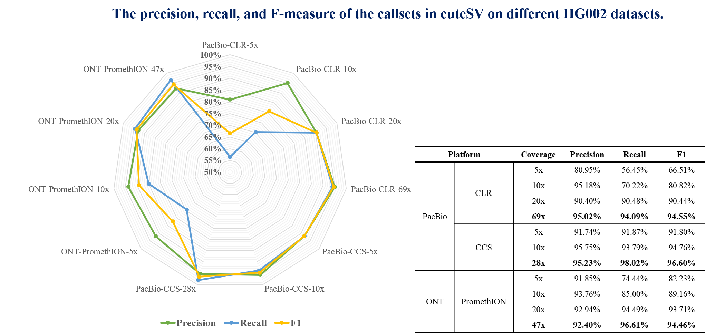

# cuteSV

---
### Getting Start
	                                               __________    __       __
	                                              |   ____   |  |  |     |  |
	                          _                   |  |    |__|  |  |     |  |
	 _______    _     _   ___| |___     ______    |  |          |  |     |  |
	|  ___  |  | |   | | |___   ___|   / ____ \   |  |_______   |  |     |  |
	| |   |_|  | |   | |     | |      / /____\ \  |_______   |  |  |     |  |
	| |        | |   | |     | |      | _______|   __     |  |  \  \     /  /
	| |    _   | |   | |     | |  _   | |     _   |  |    |  |   \  \   /  /
	| |___| |  | |___| |     | |_| |  \ \____/ |  |  |____|  |    \  \_/  /
	|_______|  |_______|     |_____|   \______/   |__________|     \_____/

---	
### Installation
	$ pip install cuteSV
	or
	$ conda install -c bioconda cutesv
	or 
	$ git clone https://github.com/tjiangHIT/cuteSV.git && cd cuteSV/ && pip install .

---	
### Introduction
Long-read sequencing enables the comprehensive discovery of structural variations (SVs). However, it is still non-trivial to achieve high sensitivity and performance simultaneously due to the complex SV signatures implied by the noisy long reads. Therefore, we propose cuteSV, a sensitive, fast and scalable long read-based SV detection approach. cuteSV uses tailored methods to collect the signatures of various types of SVs and it employs a clustering-and-refinement method to analyze the signatures to implement sensitive SV detection. Benchmark on real PacBio and ONT datasets demonstrate that cuteSV has better yields and scalability than state-of-the-art tools.

The benchmark results of cuteSV on the HG002 human sample are below:

BTW, we used [Truvari](https://github.com/spiralgenetics/truvari) to calculate the recall, precision, and f-measure.

---
### Dependence
	
	1. python3
	2. pysam
	3. Biopython
	4. cigar
	5. numpy

---
### Usage
	cuteSV <sorted.bam> <output.vcf> <work_dir>
	
*Suggestions*

	> For PacBio CLR data:
		--max_cluster_bias_INS		100
		--diff_ratio_merging_INS	0.2
		--diff_ratio_filtering_INS	0.6
		--diff_ratio_filtering_DEL	0.7
	> For PacBio CCS(HIFI) data:
		--max_cluster_bias_INS		200
		--diff_ratio_merging_INS	0.65
		--diff_ratio_filtering_INS	0.65
		--diff_ratio_filtering_DEL	0.35
	
| Parameter | Description | Default |
| :------------ |:---------------|-------------:|
|--threads|Number of threads to use.| 16 |
|--batches| Batch of genome segmentation interval.        |10,000,000|
|--sample| Sample name/id |NULL|
|--max_split_parts|Maximum number of split segments a read may be aligned before it is ignored.|7|
|--min_mapq|Minimum mapping quality value of alignment to be taken into account.|20|
|--min_read_len|Ignores reads that only report alignments with not longer then bp.|500|
|--min_support|Minimum number of reads that support a SV to be reported.|3|
|--min_length|Minimum length of SV to be reported.|30|
|--max_cluster_bias_INS|Maximum distance to cluster read together for insertion.|100|
|--diff_ratio_merging_INS|Do not merge breakpoints with basepair identity more than the ratio of *default* for insertion.|0.2|
|--diff_ratio_filtering_INS|Filter breakpoints with basepair identity less than the ratio of *default* for insertion.|0.6|
|--max_cluster_bias_DEL|Maximum distance to cluster read together for deletion.|200|
|--diff_ratio_merging_DEL|Do not merge breakpoints with basepair identity more than the ratio of *default* for deletion.|0.3|
|--diff_ratio_filtering_DEL|Filter breakpoints with basepair identity less than the ratio of *default* for deletion.|0.7|
|--max_cluster_bias_INV|Maximum distance to cluster read together for inversion.|500|
|--max_cluster_bias_DUP|Maximum distance to cluster read together for duplication.|500|
|--max_cluster_bias_TRA|Maximum distance to cluster read together for translocation.|50|
|--diff_ratio_filtering_TRA|Filter breakpoints with basepair identity less than the ratio of *default* for translocation.|0.6|

---
### Datasets generated from cuteSV
We provided the SV callsets of the HG002 human sample produced by cuteSV form three different long-read sequencing platforms (i.e. PacBio CLR, PacBio CCS, and ONT PromethION). 

You can download them at: 

Please cite the manuscript of cuteSV before using these callsets.

---
### Changelog

	cuteSV (v1.0.2):
	1.Improve the genotyping performance and enable it to be default option.
	2.Make the description of parameters better.
	3.Modify the header description of vcf file.
	4.Add two new indicators, i.e., BREAKPOINT_STD and SVLEN_STD, to further characterise deletion and insertion.
	5.Remove a few redundant functions which will reduce code readability.

---
### Citation
Long Read based Human Genomic Structural Variation Detection with cuteSV. Tao Jiang, et al. bioRxiv 780700; doi: https://doi.org/10.1101/780700
	
---
### Contact
For advising, bug reporting and requiring help, please post on [Github Issue](https://github.com/tjiangHIT/cuteSV/issues) or contact tjiang@hit.edu.cn.
